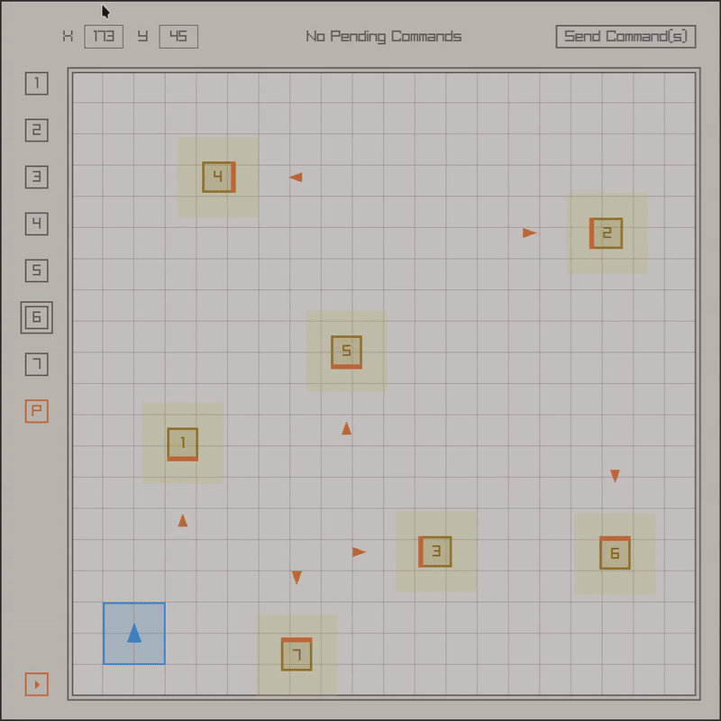

# MDP Algorithm (WIP)

<p align="center">
  
</p>

## Build Instructions

You may use the shellscript (`compile.sh`) for convenience.

```bash
chmod +x ./compile.sh
./compile.sh
```

## Usage Guide

### Obstacles/Robot

Using the left panel you may control both the positions and orientations of the obstacles/robots.

#### Bindings

- `j` (move the selector down by one)
- `k` (move the selector up by one)
- `<arrow_key>` (move the object in the corresponding direction)
- `<shift> + <arrow_key>` (orientate the object in the corresponding direction)
- `<space>` (toggle the visited/unvisited status of an object)
- `<shift> + <space>` (hide/unhide an obstacle)
- `<click>` (select an object)

> For extra precision, you may also input the exact coordinates in the top panel

### Routing

A solution to the problem involves visiting all obstacles in such a way that the robot
faces the "glowing edge" of the obstacle (for image recognition purposes). To generate
a solution, click the *play button* at the bottom left corner. Depending on the positions
of the objects, a solution isn't always possible. The success/failure of the algorithm
will be displayed on the left panel.

> To generate a solution, use `<shift> + r`.

> [!NOTE]
> Currently, the optimal path is generated by running multiple single-source shortest paths in parallel
> before constructing the Hamiltonian path using the Held-Karp algorithm. Some heuristics may be added
> in the future to improve performance.

### Instructions

There are ten kinds of basic instructions:

- `F<x>` (move forward by `x` cm)
- `B<x>` (move backwards by `x` cm)
- `TL<x>` (turn left by `x` degrees)
- `TR<x>` (turn right by `x` degrees)
- `FL` (move forward towards the left in a quarter circle)
- `FR` (move forward towarsd the right in a quarter circle)
- `BL` (move backward towards the left in a quarter circle)
- `BR` (move backward towarsd the right in a quarter circle)
- `SCAN` (scan the obstacle, i.e., convert it to the "visited" state)
- `FIN` (signify that there are no steps left)

Examples include `F10` (move forward by `10` cm), and `TL90` (turn left by `90` degrees).

For convenience, you may also insert commands directly into the pipeline using:

- `<shift> + w` (`F10`)
- `<shift> + x` (`B10`)
- `<shift> + a` (`TL45`)
- `<shift> + d` (`TR45`)
- `<shift> + q` (`FL`)
- `<shift> + e` (`FR`)
- `<shift> + z` (`BL`)
- `<shift> + c` (`BR`)

> `TL` and `TR` are disabled for now...

## Networking

To interact with the RPI, you may use `server_experiment.py` for reference. After starting the server
using `python server_experiment.py`, you may send the current pipeline of instructions to the RPI
by clicking on the top right button.
